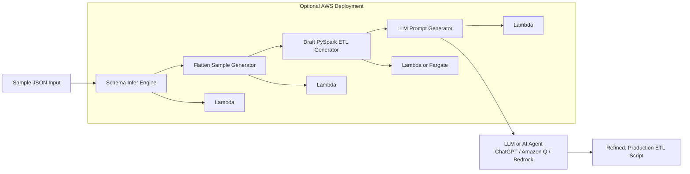

# AI-Assisted PySpark ETL Code Generator (Agent-Ready)

This project is an **data engineering tool** that:
- infers schema from nested JSON,
- flattens sample data,
- generates draft PySpark ETL code,
- produces suggested data quality checks,
- writes structured metadata outputs,
- and creates a fully structured **LLM-ready prompt** for further ETL refinement.
- refines the ETL using **Amazon Bedrock (Llama 3)**,
- and outputs production-style ETL code into `refined_etl.py`.

It demonstrates how  prompt engineering can accelerate ETL development and onboarding new datasets.

---
## Features
- **Schema inference** for nested JSON + arrays  
- **Draft ETL generation** using deterministic rules  
- **LLM-refined ETL** with clean, production-ready PySpark  
- **Array explode support** for array-of-struct fields  
- **Agent workflow simulation** (`agent_demo.py`)

---

It is explicitly designed to be used by:
- **AI Coding Assistants** (ChatGPT, Amazon Q, Cursor, Copilot), and  
- **AI Agents / Agentic Workflows** (Bedrock Agents, LangChain, Step Functions Agents).

---

#  What This Tool Does

Given a sample JSON, It produces:

### ✔ 1. Inferred flattened schema  
### ✔ 2. Draft PySpark ETL code  
### ✔ 3. Sample flattened record  
### ✔ 4. Suggested Data Quality (DQ) checks  
### ✔ 5. schema_output.json  
### ✔ 6. LLM-Ready Prompt (llm_prompt.txt)
### ✔ 7. Generates production-style ETL code into `refined_etl.py`

The LLM prompt contains everything an AI agent needs to refine the ETL into a production-ready script.

##  Architecture (AI-First Engineering)

### 🔹 AI Refinement Using Amazon Bedrock (Llama 3 Instruct)

This project integrates with **Amazon Bedrock (meta.llama3-70b-instruct-v1:0)**  
to refine the auto-generated ETL code.

Llama 3 Instruct is available immediately (no model approval required),
so the AI refinement step works end-to-end.

Refinement process:
1. Draft ETL is generated locally
2. A structured prompt is created
3. Prompt is sent to Bedrock using boto3
4. Llama 3 Instruct returns a production-ready PySpark ETL script
5. Output is written to `refined_etl.py`

