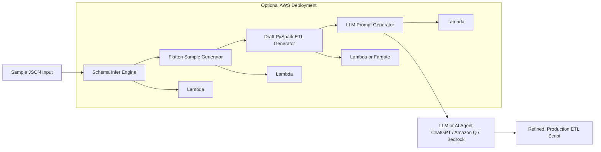

# AI-Assisted PySpark ETL Code Generator (Agent-Ready)

This project is an **data engineering tool** that:
- infers schema from nested JSON,
- flattens sample data,
- generates draft PySpark ETL code,
- produces suggested data quality checks,
- writes structured metadata outputs,
- and creates a fully structured **LLM-ready prompt** for further ETL refinement.

It demonstrates how  prompt engineering can accelerate ETL development and onboarding new datasets.

---

It is explicitly designed to be used by:
- **AI Coding Assistants** (ChatGPT, Amazon Q, Cursor, Copilot), and  
- **AI Agents / Agentic Workflows** (Bedrock Agents, LangChain, Step Functions Agents).

---

#  What This Tool Does

Given a sample JSON, It produces:

### ✔ 1. Inferred flattened schema  
### ✔ 2. Draft PySpark ETL code  
### ✔ 3. Sample flattened record  
### ✔ 4. Suggested Data Quality (DQ) checks  
### ✔ 5. schema_output.json  
### ✔ 6. LLM-Ready Prompt (llm_prompt.txt)

The LLM prompt contains everything an AI agent needs to refine the ETL into a production-ready script.

## 🏗 Architecture (AI-First Engineering)

